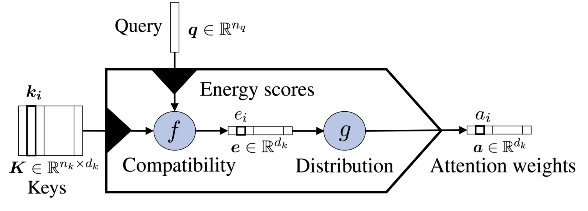
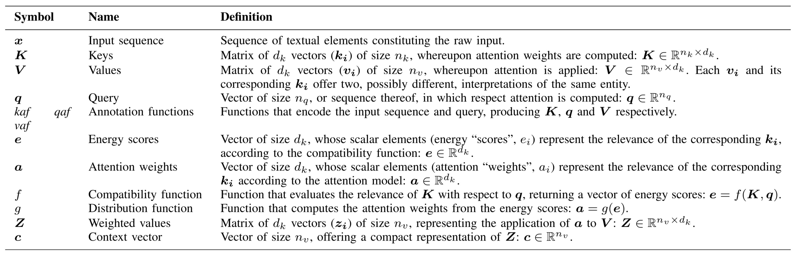
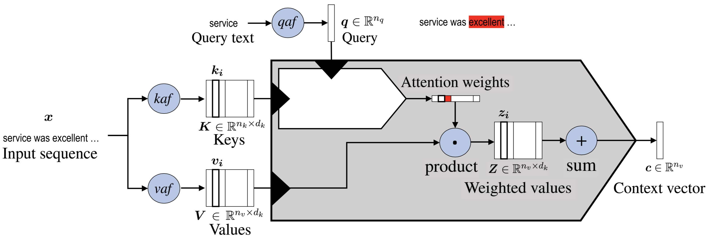
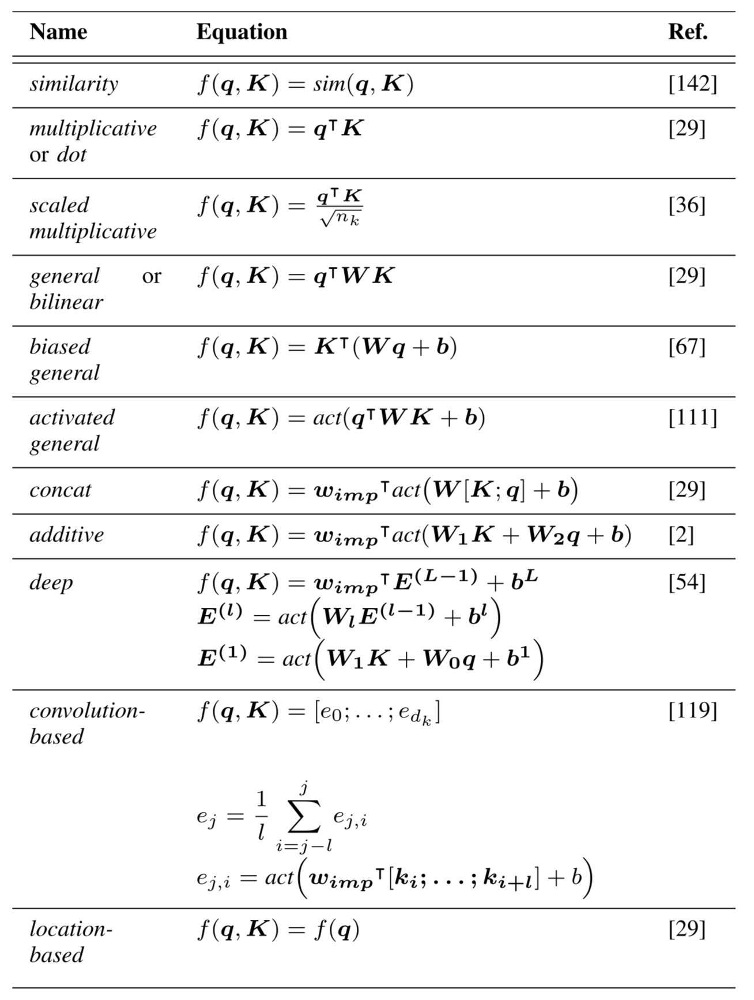

# Attention

Paper: https://arxiv.org/pdf/1811.05544.pdf, https://arxiv.org/pdf/1902.02181.pdf

First derived from human intuition, attention mechanism is a simple method that can be used for encoding sequence data based on the importance score each element is assigned.

## Why Attention?

RNN-based architecture suffers from two serious drawbacks: 1) RNN is forgetful, 2) there is no explicit word alignment during decoding. 

Attention is the commonest solution to the problem: elements composing the source text are characterized by having each a different relevance to the task.

The attention mechanism can also be used as a tool for interpreting the behavior of neural architectures, which are notoriously difficult to understand. Attention could provide a key to partially interpret and explain neural network behavior, even if it cannot be considered a reliable means of explanation.

## Formulation

The core idea behind attention is to compute a weight distribution on the input sequence, assigning higher values to more relevant elements.

Unified Attention Model: 

The core of the attention mechanism maps a sequence $\boldsymbol{K}$ of $d_{k}$ vectors $\boldsymbol{k}_{\boldsymbol{i}},$ the keys, to a distribution $\boldsymbol{a}$ of $d_{k}$ weights $a_{i} .$ K encodes the data features whereupon attention is computed. 

key terms and symbols:

General attention model: 

Each element of **V** corresponds to one and only one element of **K** , and the two can be seen as different representations of the same data. 

**V** and **a** are thus combined to obtain a new set **Z** of weighted representations of **V**: $z_i = a_iv_i$, which are then merged together so as to produce a compact representation of **Z** usually called the context vector **c**： $c = \sum_{i=1}^{d_k} z_i$.

 

## Usage

Attention enables us to **estimate the relevance of the input elements** as well as to **combine said elements into a compact representation**—the context vector—that condenses the characteristics of the most relevant elements.

| Use                             | Tasks                                                        |
| ------------------------------- | ------------------------------------------------------------ |
| Feature selection               | Multimodal task                                              |
| Auxiliary task                  | Visual question answering Semantic role labelling       |
| Contextual embedding creation   | Machine Translation Sentiment Analysis Information Extraction |
| Sequence-to-sequence annotation | Machine Translation                                          |
| Word Selection                  | Dependency Parsing Cloze Question Answering             |
| Multiple input processing       | Question Answering                                           |

For tasks such as document classification, where usually there is only **K** in input and no query, the attention mechanism can be seen as an instrument to **encode the input into a compact form**.

When the generation of a text sequence is required, as in machine translation, attention enables us to make use of a dynamic representation of the input sequence. More generally, the possibility to perform attention with respect to a query **q** allows us to create representations of the input that depend on the task *context*, creating specialized embeddings.

Since attention can create contextual representations of an element, it can also be used to build seq2seq annotators, without resorting to RNNs or CNNs.

## Taxonomy

Attention models can be described on the basis of the following orthogonal dimensions: **the nature of inputs**, the **compatibility** function, the **distribution** function, and the number of distinct inputs/outputs, which we refer to as “**multiplicity**”. Moreover, attention modules can be used inside larger attention models to obtain complex architectures such as **hierarchical-input** models or in some **multiple-input coattention** models.

### Input Representation

**K** and **V** are representations of parts of documents. These components are usually embedded into continuous vector representations and then processed through key/value annotation functions(kaf/vaf) so as to obtain a hidden representation resulting in **K** and **V**.

Typical annotation functions are RNN layers(GRUs, LSTMs), CNNS.

In this way, $k_i$ and $v_i$ represent an input element relative to its local context. If the layers in charge of annotation are trained together with the attention model, they can learn to encode information useful to the attention model.

Alternatively, $k_i /v_i$ can be taken to represent each input element in isolation, rather than in context.

**K** can also represent a single element of the input sequence.

Two successful structures:

1. Self-attention

a distinction between two input sources: 1) the input sequence, represented by **K** and **V**, and 2) the query.  The commonest one amounts to the application of multiple steps of attention to a vector **K**, **using the elements $k_t$ of the same vector as query at each step**. 

Attention could thus be used as a sequence-to-sequence model. In this way, each element of the new sequence may be influenced by elements of the whole input, incorporating contextual information without any locality boundaries.

The analysis of these distributions will provide information regarding the relationship between the elements inside the sequence. Another possibility is to construct a single query element **q** from the keys through a pooling operation.

2. Hierarchical-Input Architectures

Data naturally associated with a two-level semantic structure, such as characters (**the “micro” elements**) forming words (**the “macro” elements**) or words forming sentences.

If representations for both micro- and macro-level elements are available, one can compute attention on one level and then exploit the result as a key or query to compute attention on the other, yielding two different micro-representation/macro-representation of *D*. In this way, attention enables us to identify the most relevant elements for the task at both levels.

### Compatibility Functions

It defines how keys and queries are matched or combined. Two main approaches for common compatibility functions: 1) match and compare **K** and **q**. 2) combine rather than compare **K** and **q**, use them together to compute a joint representation

1) These approaches are particularly suitable in tasks where the concept of relevance of a key is known to be closely related to that of similarity to a query element. These include, for instance, tasks where specific keywords can be used as a query, such as abusive speech recognition and sentiment analysis.

2) These approaches are especially suitable when a representation of “relevant” elements is unavailable or it is available but encoded in a significantly different way from the way that keys are encoded. This may be the case, for instance, with tasks such as document classification and summarization.

The compatibility functions for self-attention, which are a special case of the more general functions, are omitted from Table.

### Distribution Functions

Attention distribution **maps energy scores to attention weights**. The choice of the distribution function **depends on the properties that the distribution is required to have** (for instance, whether it is required to be a probability distribution[a set of probability scores], or a set of Boolean scores—on the need to enforce sparsity, and on the need to account for the keys’ positions.)

One possible distribution function *g* is the logistic sigmoid/ a softmax function. In that case, the attention mechanism is called **soft attention**. Each attention weight can be interpreted as the probability that the corresponding element is the most relevant.

Some parts of the input are completely irrelevant, and if they were to be considered, they would likely introduce noise rather than contribute with useful information. One option is the sparsemax distribution(truncates to zero the scores under a certain threshold). 

It could be helpful to focus the attention only on a specific portion of the input. If the position is known in advance, one can apply a positional mask, by adding/subtracting a given value from the energy scores before the application of the softmax. Since the location may not be known in advance, the **hard attention** model considers the keys in a dynamically determined location(but it is not differentiable). **Local attention**(preserving differentiability) considers only a small window(fixed size) of the keys at a time. 

### Multiplicity

variations of the general unified model: accommodate multiple, possibly heterogeneous, inputs or outputs. 

1. Multiple Outputs: 

   Data could, and should, be interpreted in multiple ways. Models have been defined that jointly compute not only one but multiple attention distributions over the same data. One possibility presented is to use **additive attention with an importance matrix**. Another possibility is **multihead attention**. Multihead attention can be especially helpful when combined with nonsoft attention distribution since different heads can capture local and global contexts at the same time 

2. Multiple Inputs:

   *Coattention:* Some architectures consider the query to be a sequence of $d_q$  multidimensional elements rather than by a plain vector. Coattention models can be coarse-grained or fine-grained.

   A. Coarse-grained coattention: use **a compact representation** of one input to compute attention on the other

   B. Fine-grained coattention: the relevance (energy scores) associated with each key/query element pair $<k_i/q_j>$  is represented by the elements $E_{j,i}$ of a coattention matrix $E\in R^{d_q \times d_k}$ computed by a cocompatibility function.

   
   
## Combine Knowledge	

   TODO

   

## Challenges

TODO

   

   

