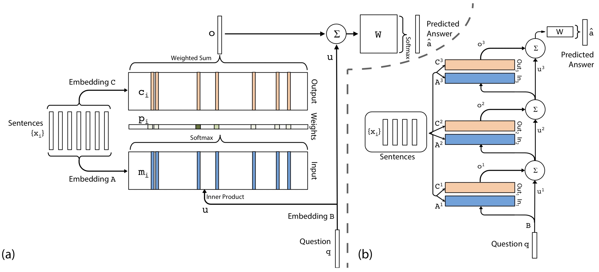

# MemN2N

paper: https://arxiv.org/abs/1503.08895


## Motivation

Two grand challenges in AI research have been to 1) build models that can make multiple computational steps in the service of answering a question or completing a task, and 2) models that can describe **long term dependencies** in sequential data.  

Our model can be considered **a continuous form of the Memory Network**. The model in that [work](../README.md) was not easy to train via backpropagation, and required supervision at each layer of the network. 


## Approach


### Single Layer

1. Input memory representation: 

The entire set of $\left\{x_{i}\right\}$ are converted into memory vectors $\left\{m_{i}\right\}$ of dimension $d$ computed **by embedding each $x_{i}$ in a continuous space**, in the simplest case, using an embedding matrix $A$ (of size $d \times V$ ). **The query $q$ is also embedded** (again, in the simplest case via another embedding matrix B) to obtain an internal state $u$.

We compute the match between $u$ and each memory $m_{i}$ by taking the inner product followed by a softmax: $p_{i}=\operatorname{Softmax}\left(u^{T} m_{i}\right)$ as probability vector over the inputs.


2. Output memory representation:

Each $x_{i}$ has a corresponding output vector $c_{i}$(embedding matrix $C$). The response vector from the memory $o$ is then a sum over the transformed inputs $c_i$: $o=\sum_{i} p_{i} c_{i}$


3. Generating the final prediction:

In the single layer case, the sum of the output vector $o$ and the input embedding $u$ is then passed through a final weight matrix $W$ and a softmax to produce the predicted label: $\hat{a}=\operatorname{Softmax}(W(o+u))$


During training, all three embedding matrices A, B and C, as well as W are jointly learned.



(a): A single layer version of our model. 

(b): A three layer version of our model. In practice, we can constrain several of the embedding matrices to be the same. 


### Multiple Layers

The memory layers are stacked in the following way: 

- The input to layers above the first is the sum of the output $o^{k}$ and the input $u^{k}$ from layer $k$: $u^{k+1}=u^{k}+o^{k}$
- Each layer has its own embedding matrices $A^{k}, C^{k},$ used to embed the inputs $\left\{x_{i}\right\} .$ (They are constrained to ease training and reduce the number of parameters)
- At the top of the network, $\hat{a}=\operatorname{Softmax}\left(W u^{K+1}\right)=\operatorname{Softmax}\left(W\left(o^{K}+u^{K}\right)\right)$


two types of weight tying within the model:

1. **Adjacent**: the output embedding for one layer is the input embedding for the one above,
   i.e. $A^{k+1}=C^{k} .$ Constrain (a) the answer prediction matrix to be the same as the final output embedding, i.e $W^{T}=C^{K},$ and $(\mathrm{b})$ the question embedding to match the input embedding of the first layer, i.e. $B=A^{1}$.
2. **Layer-wise (RNN-like)**: the input and output embeddings are the same across different layers, i.e. $A^{1}=A^{2}=\ldots=A^{K}$ and $C^{1}=C^{2}=\ldots=C^{K}$. it's useful: $u^{k+1}=H u^{k}+o^{k} .$ This mapping is learnt along with the rest of the parameters.


## Model Details

all experiments used a K = 3 hops model with the adjacent weight sharing scheme.

**Sentence Representation**: 

1. (BoW) representation: takes the sentence $x_{i}=\left\{x_{i 1}, x_{i 2}, \ldots, x_{i n}\right\},$  $m_{i}=\sum_{j} A x_{i j}$ and $c_{i}=\sum_{j} C x_{i j} .$ The input vector $u$ representing the question is also embedded as a bag of words: $u=\sum_{j} B q_{j} .$ Drawback: cannot capture the order of the words in the sentence.
2. Position Encoding (PE): $l_{k j}=(1-j / J)-(k / d)(1-2 j / J)$


**Temporal Encoding**:

To require some notion of temporal context, so modify the memory: $m_{i}=\sum_{j} A x_{i j}+T_{A}(i),$ where $T_{A}(i)$ is the $i$ th row of a special matrix $T_{A}$ that encodes temporal information. The output embedding is also like this. Note that sentences **are indexed in reverse order**, reflecting their relative distance from the question so that $x_1$ is the last sentence of the story.


**Learning time invariance by injecting random noise**:

add “dummy” memories to regularize $T_A$(randomly add 10% of empty memories to the stories).


**linear start (LS) training**:

we explored commencing training with the softmax in each memory layer removed, making the model entirely linear except for the final softmax for answer prediction. When the validation loss stopped decreasing, the softmax layers were re-inserted and training recommenced.


## Simulation

```python
def to_var(x):
    return x.cuda() if torch.cuda.is_available() else Variable(x)
  

class MemNN(nn.Module):
    def __init__(self, vocab_size, embed_size, max_story_len, hops=3, dropout=0.2, te=True, pe=True):
        super(MemNN, self).__init__()
        self.hops = hops
        self.embed_size = embed_size
        self.temporal_encoding = te
        self.position_encoding = pe
        self.max_story_len = max_story_len

        init_rng = 0.1
        self.dropout = nn.Dropout(p=dropout)
        self.A = nn.ModuleList([nn.Embedding(vocab_size, embed_size) for _ in range(hops + 1)])
        for i in range(len(self.A)):
            self.A[i].weight.data.normal_(0, init_rng)
            self.A[i].weight.data[0] = 0  # for padding index
        self.B = self.A[0]  # query encoder

        # Temporal encoding
        if self.temporal_encoding:
            self.TA = nn.Parameter(torch.Tensor(1, max_story_len + 1, embed_size).normal_(0, 0.1))
            self.TC = nn.Parameter(torch.Tensor(1, max_story_len + 1, embed_size).normal_(0, 0.1))

    def forward(self, x, q):
        bs, story_len, s_sent_len = x.size()
        
        # position Encoding
        if self.position_encoding:
            J = s_sent_len
            d = self.embed_size
            j_div_J = to_var(torch.arange(1, J+1, dtype=torch.float) / J).unsqueeze(1).repeat(1, d)
            k_div_d = to_var(torch.arange(1, d+1, dtype=torch.float) / d).unsqueeze(0).repeat(J, 1)
            pe = (1 - j_div_J) - k_div_d * (1 - 2 * j_div_J)
            pe = pe.unsqueeze(0).unsqueeze(0)  # [1,1,s_sent_len,embed_size]
            pe = pe.repeat(bs, story_len, 1, 1)  # [bs,story_len,s_sent_len,embed_size]
        u = self.dropout(self.B(q))  # [bs, q_sent_len, embed_size]
        u = torch.sum(u, dim=1)  # (bs, embd_size)

        # Adjacent weight tying
        for k in range(self.hops):
            m = self.dropout(self.A[k](x))  # [bs, story_len, s_sent_len, embed_size]
            if self.position_encoding:
                m *= pe  # [bs,story_len,s_sent_len,embed_size]
            m = torch.sum(m, 2)  # [bs, story_len, embed_size]
            if self.temporal_encoding:
                n = self.TA[:, :story_len, :].repeat(bs, 1, 1)
                m += n
            c = self.dropout(self.A[k + 1](x))  # [bs, story_len,s_sent_len,embed_size]
            c = torch.sum(c, 2)  # (bs, story_len, embd_size)
            if self.temporal_encoding:
                c += self.TC[:, :story_len, :].repeat(bs, 1, 1)  # (bs, story_len, embd_size)
            p = torch.bmm(m, u.unsqueeze(2)).squeeze()  # [bs,story_len]
            p = F.softmax(p, -1).unsqueeze(1)  # [bs,1,story_len]
            o = torch.bmm(p, c).squeeze(1)  # use m as c ,[bs,embed_size]
            u = o + u  # [bs,embed_size]
        W = torch.t(self.A[-1].weight)  # [embed_szie,vocab_size]
        # [bs,1,embed_size] * [bs,embed_size,vocab_size] ==> [bs,ansize,vocab_size] ==>[bs,ansize]
        out = torch.bmm(u.unsqueeze(1), W.unsqueeze(0).repeat(bs, 1, 1)).squeeze()
        return F.log_softmax(out, -1)
```


## Results

Test set has 1k/10k data, so I consider Error <= Paper Error + 2.0% are passed.

Instead of Linear start, I use Adam.

| Task/Error | Test/1K | Paper | Pass | Test/10K | Paper | Pass |
| ---------- | ------- | ----- | ---- | -------- | ----- | ---- |
| Task1      | 0.0     | 0.0   | 🉑️    | 0.0      | 0.0   | 🉑️    |
| Task2      | 22.3    | 11.4  |      | 0.3      | 1.0   | 🉑️    |
| Task3      | 29.8    | 21.9  |      | 13.5     | 6.8   |      |
| Task4      | 22.0    | 13.4  |      | 22.1     | 0.0   |      |
| Task5      | 18.9    | 14.4  |      | 6.9      | 6.1   | 🉑️    |
| Task6      | 9.5     | 2.8   |      | 7.2      | 0.1   |      |
| Task7      | 16.8    | 18.3  |      | 8.3      | 6.6   | 🉑️    |
| Task8      | 11.6    | 9.3   |      | 2.7      | 2.7   | 🉑️    |
| Task9      | 6.5     | 1.9   |      | 6.1      | 0.0   |      |
| Task10     | 13.4    | 6.5   |      | 2.3      | 0.5   | 🉑️    |
| Task11     | 0.3     | 0.3   | 🉑️    | 0.0      | 0.0   | 🉑️    |
| Task12     | 0.0     | 0.1   | 🉑️    | 0.0      | 0.1   | 🉑️    |
| Task13     | 0.0     | 0.2   | 🉑️    | 0.0      | 0.0   | 🉑️    |
| Task14     | 0.2     | 6.9   | 🉑️    | 0.0      | 0.0   | 🉑️    |
| Task15     | 0.0     | 0.0   | 🉑️    | 0.0      | 0.2   | 🉑️    |
| Task16     | 53.4    | 2.7   |      | 51.0     | 0.2   |      |
| Task17     | 41.9    | 40.4  | 🉑️    | 37.7     | 41.8  | 🉑️    |
| Task18     | 47.6    | 9.4   |      | 43.9     | 8.0   |      |
| Task19     | 90.0    | 88.0  | 🉑️    | 72.0     | 75.7  | 🉑️    |
| Task20     | 0.8     | 0.0   | 🉑️    | 0.0      | 0.0   | 🉑️    |
| Mean Error | 19.25   | 12.4  |      | 13.7     | 7.5   |      |

Failed Task (#TODO):

Task3: three-supporting-facts

Task4: two-arg-relations

Task6: yes-no-questions

Task9: simple-negation

Task16: basic-induction

Task18: size-reasoning

