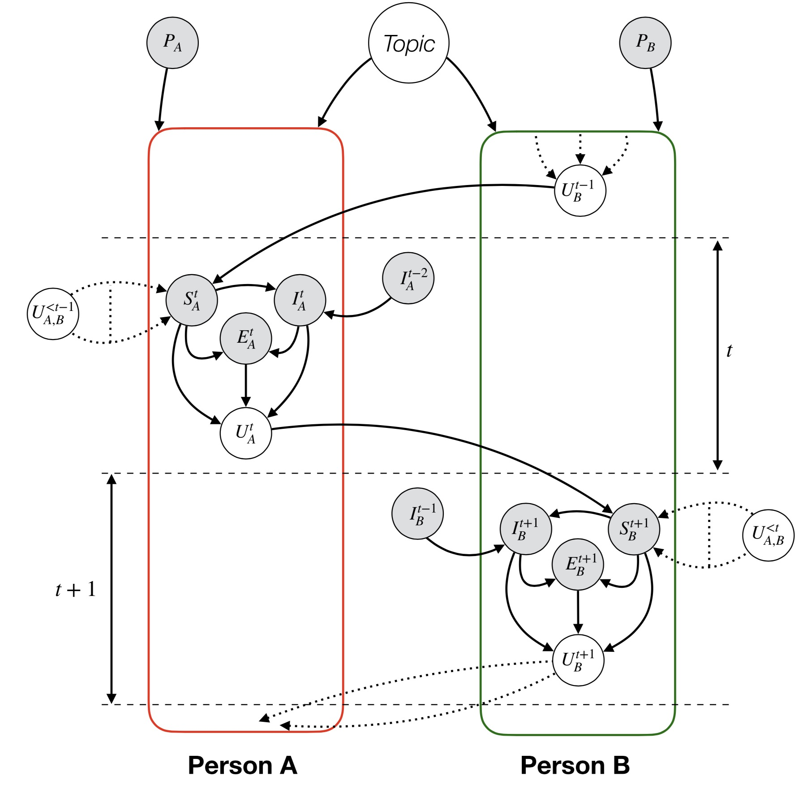
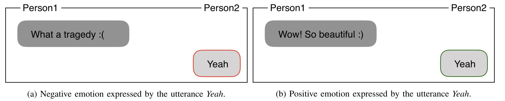
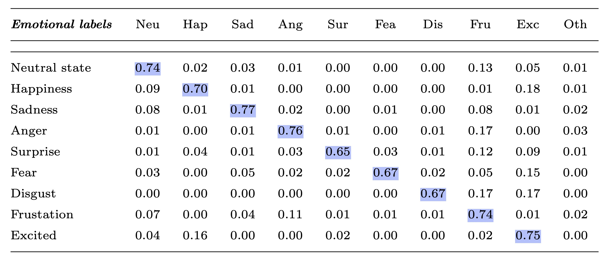

# ERC: Emotion Recognition in Conversation

Mainly Based On 《Emotion Recognition in Conversation: Research Challenges, Datasets, and Recent Advances》[1]

## The significance of this task

ERC can be used to:

1. analyze conversations that take place on social media
2. aid in analyzing conversations in real times, which can be instrumental in legal trials, interviews, e-health services, and more.

Why not vanilla emotion recognition?

1. presence of contextual cues
2. the temporality in speakers’ turns
3. speaker-specific information 

## Definition

ERC task aims to **identify the emotion of each utterance** from a set of pre-defined emotions. Given the input sequence of *N* number of utterances $\left[\left(u_{1}, p_{1}\right),\left(u_{2}, p_{2}\right), \ldots,\left(u_{N}, p_{N}\right)\right]$ where each utterance $u_{i}=\left[u_{i, 1}, u_{i, 2}, \ldots, u_{i, T}\right]$ consists of *T* words $u_{i,j}$ and  spoken by party $p_i$, the task is to predict the emotion label $e_i$ of each utterance $u_i$. 

## Controlling Variables in Conventions

Categories: task oriented and chit-chat.

Both types of conversations are governed by different factors or pragmatics: topic, interlocutors’ personality, argumentation logic, viewpoint, intent, and so on. 

How these factors play out in a dyadic conversation:

Grey and white circles represent hidden and observed variables, respectively. 

**P** represents **personality**, **U** represents **utterance**, **S** represents **interlocutor state**, **I** represents **interlocutor intent**, **E** represents **emotion** and **Topic** represents **topic of the conversation**. 

This can easily be extended to multi-party conversations.

## **Research Challenges**

### 1. Categorization of Emotions 

Emotion is defined using two type of models: 1) categorical and 2) dimensional. 

**A. Categorical model classifies emotion into a fixed number of discrete categories.** 

Ekman[3] concludes six basic emotions — anger, disgust, fear, happiness, sadness, and surprise.

Choosing a simple categorization model e.g., Ekman’s model has a major drawback as **these models are unable to ground complex emotions**  while complex emotion models make it very difficult for the annotators to discriminate between the related emotions (anger / rage).

Complex emotion models also increase the risk of obtaining a lower [inter-annotator agreement](https://towardsdatascience.com/inter-annotator-agreement-2f46c6d37bf3)(IAA).

**B. dimensional model describes emotion as a point in a continuous multi-dimensional space.**

Most dimensional categorization models adopt two dimensions — valence and arousal: Valence represents the degree of emotional positivity and arousal represents the intensity of the emotion.

This enables easy and intuitive comparison of two emotional states using vector operations.

> Note: Besides the above 2 Categorizations, the appraisal approach studies the links between emotions and elicited cognitive reactions, another type of emotion representation is distributional, i.e., using embedding to represent an emotion.

### 2. Basis of Emotion Annotation

Self-assessment by the interlocutors in a conversation is arguably the best way to annotate utterances. In practice it is unfeasible as real-time tagging of unscripted conversations will impact the conversation flow(Post-conversation self-annotation could be an option). 

The annotators also need to be aware of the interlocutors perspective for situation-aware annotation.

### 3. Conversational Context Modeling 

Similarly in conversational emotion-detection, to determine the emotion of an utterance at time *t* , the preceding utterances at time < *t* can be considered as its context. However, computing this context representation often exhibits major difficulties **due to emotional dynamics**.

Emotional dynamics of conversations consists of two important aspects: *self* and *inter-personal dependencies:

**Self-dependency**, also known as *emotional inertia*, deals with the aspect of emotional influence that speakers have on themselves during conversations.

**Inter-personal dependencies** relate to the emotional influences that the counterparts induce into a speaker.

Modeling self and inter-personal relationship and dependencies may also **depend on the topic of the conversation as well as various other factors** like argument structure, interlocutors’ personality, intents, viewpoints on the conversation, attitude towards each other etc.. Hence, analyzing all these factors are key for a true self and inter-personal dependency modeling that can lead to enriched context understanding.

The contextual information can come from both local and **distant conversational history**. Distant contextual information is useful mostly in the scenarios when a speaker refers to earlier utterances spoken by any of the speakers in the conversational history.

The usefulness of context is more prevalent in classifying short utterances, like below.

### 4. Speak Speific Modeling

Individuals have their own subtle way of expressing emotions. Since, necessary background information is often missing from the conversations, speaker profiling based on preceding utterances often yields improved results.

### 5. Listener Specfic Modeling 

During a conversation, the listeners make up their mind about the speaker’s utterance as it’s spoken.

There is no textual data on the listener’s reaction to the speaker while the speaker speaks. A model must resort to visual modality to model the listener’s facial expression to capture the listener’s reaction.

Nonetheless, listener modeling can be useful in the scenarios where continuous emotion recognition of every moment of the conversation is necessary, like audience reaction during a political speech.

### 6. Presence of Emotion Shift

Due to *emotional inertia*, participants in a conversation tend to **stick a particular emotional state**, unless some external stimuli, usually the other participants, invoke a change.

To tackle this, a new problem of detecting emotion shift can be framed:

1. based on the historical utterances and the present utterance, is there an emotion shift (binary classification)?
2. if there is a shift then what is the target emotion (multi-label classification)?

### 7. Fine-Grained Emotion Recogniton

It aims at recognizing emo- tion expressed on explicit and implicit topics.

### 8.Multiparty Conversation 

How to track individual speaker states and handling co-references?

### 9. Presence of Sarcasm

Sarcasm is a linguistic tool that uses irony to express contempt. An ERC system incapable of detecting sarcasm mostly fails to predict emotion of the sarcastic utterances correctly. Sarcasm detection in a conversation largely depends on the context and discourse of the conversation.

### 10. Emotion Reasoning

The ability to reason is necessary for any explainable AI system. In the context of ERC, it is often desired to understand the cause of an expressed emotion by a speaker.

Unlike context modeling, emotion reasoning does not only find the contextual utterances in conversational history that triggers the emotion of an utterance, but also determines the function of those contextual utterances on the target utterance.

At present, there is no available dataset which contains such rich annotations. Building such dataset would enable future dialogue systems to frame meaningful argumentation logic and discourse structure, taking one step closer to human-like conversation.

## DataSets

1. SemEval-2019 Task 3 emocontext [Data](https://aka.ms/emocontextdata), **without testset ground truth**.

2. IEMOCAP [Data](https://sail.usc.edu/iemocap/iemocap_release.htm), need application. (multi-modal)

3. SEMAINE [Data](https://semaine-db.eu/) (four real valued affective attributes: valence ([−1, 1]), arousal ([−1, 1]), expectancy ([−1, 1]), and power ([0, ∞))) (multi-modal)
4. DailyDialog [Data](http://yanran.li/files/ijcnlp_dailydialog.zip) 
5. MELD [Data](http://web.eecs.umich.edu/~mihalcea/downloads/MELD.Raw.tar.gz) (multi-modal)
6. EmotionPush [Data](https://sites.google.com/view/emotionx2019/datasets)
7. EmoryNLP [Data](https://github.com/emorynlp/emotion-detection)

$$
\begin{array}{cccccc}
\hline \text { Label } & \text { DailyDialog } & \text { MELD } & \text { EmotionLines } & \text { IEMOCAP } & \text { EmoContext } \\
\hline \text { Neutral } & 85572 & 6436 & 6530 & 1708 & - \\
\text { Happiness/Joy } & 12885 & 2308 & 1710 & 648 & 4669 \\
\text { Surprise } & 1823 & 1636 & 1658 & - & - \\
\text { Sadness } & 1150 & 1002 & 498 & 1084 & 5838 \\
\text { Anger } & 1022 & 1607 & 772 & 1103 & 5954 \\
\text { Disgust } & 353 & 361 & 338 & - & - \\
\text { Fear } & 74 & 358 & 255 & - & - \\
\text { Frustrated } & - & - & - & 1849 & - \\
\text { Excited } & - & - & - & 1041 & - \\
\text { Other } & - & - & - & - & 21960 \\
\hline
\end{array}
$$

## Recent Advances

// TODO

