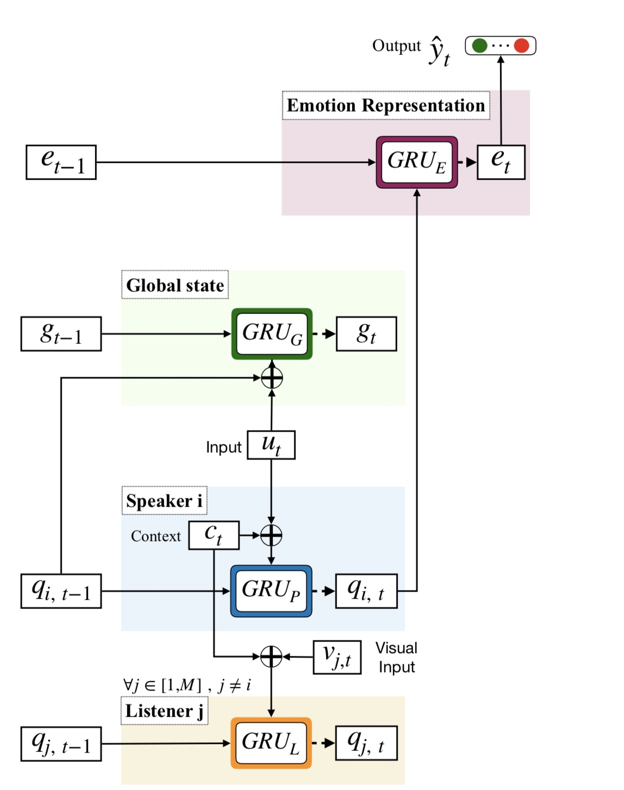

# DialogueRNN: An Attentive RNN for Emotion Detection in Conversations

Paper: https://arxiv.org/abs/1811.00405


## Motivation

Current systems do not distinguish different parties in a conversation in a meaningful way.

This paper model individual parties with party states, as the conversation flows, by relying on the utterance, the context, and current party state.

Based on the assumption that there are three major aspects relevant to the emotion in a conversation: the **speaker**, the **context from the preceding utterances**, and the **emotion of the preceding utterances**.


## Model

**Textual Feature Extraction**(Seq2Vec): employ convolutional neural networks (CNN) for textual feature extraction obtain n-gram features from each utterance using three distinct convolution filters of sizes 3, 4, and 5 respectively, each having 50 feature-maps.

```python
class CNNFeatureExtractor(nn.Module):
    def __init__(self, embedding_dim, output_size, filters, kernel_sizes, dropout):
        super(CNNFeatureExtractor, self).__init__()
        self.convs = nn.ModuleList(
            [nn.Conv1d(in_channels=embedding_dim, out_channels=filters, kernel_size=K) for K in kernel_sizes]
        )
        self.dropout = nn.Dropout(dropout)
        self.fc = nn.Linear(len(kernel_sizes) * filters, output_size)
        self.feature_dim = output_size

    def forward(self, x, umask):
        """
        :param x: (num_utt, batch, seq_len, embedding_dim)
        :param umask: (num_tt, batch)
        :return: (num_utt, batch, seq_dim)
        """
        num_utt, batch, seq_len, embedding_size = x.size()
        # (num_utt, batch, seq_len, embedding_dim) -> (num_utt * batch, seq_len, embedding_dim)
        x = x.view(-1, seq_len, embedding_size)
        # (num_utt*batch, seq_len, embedding_dim) -> (num_utt*batch, embedding_dim, seq_len)
        x = x.transpose(-2, -1).contiguous()
        # (num_utt*batch, embedding_dim, seq_len) -> [(num_utt*batch, cnn_filters, seq_len-kernel_size+1)]
        convoluted = [F.relu(conv(x)) for conv in self.convs]
        # (num_utt*batch, cnn_filters, seq_len-kernel_size+1) -> [(num_utt*batch, cnn_filters)]
        pooled = [F.max_pool1d(c, c.size(2)).squeeze() for c in convoluted]
        # [(num_utt*batch, output_size)] -> (num_utt*batch, cnn_filters*cnns)
        concated = torch.cat(pooled, dim=1)
        # (num_utt*batch, cnn_filters*cnns) -> (num_utt*batch, output_size)
        features = F.relu(self.fc(self.dropout(concated)))
        # (num_utt*batch, output_size) -> (num_utt, batch, output_size)
        features = features.view(num_utt, batch, -1)
        # (num_utt, batch) -> (num_utt, batch, output_size)
        umask = umask.transpose(1, 0)
        mask = umask.unsqueeze(-1).repeat(1, 1, self.feature_dim)
        # (num_utt, batch, output_size) -> (num_utt, batch, output_size)
        features = (features * mask)
        return features
```


Each party is modeled using a ***party state*** which changes as and when that party utters an utterance. This enables the model to track the parties’ emotion dynamics through the conversations, which is related to the emotion behind the utterances. Furthermore, the context of an utterance is modeled using a ***global state*** (called global, because of being shared among the parties), where the preceding utterances and the party states are jointly encoded for context representation, necessary for accurate party state representation. Finally, the model infers **emotion representation** from the party state of the speaker along with the preceding speakers’ states as context. This emotion representation is used for the final emotion classification.



```python
class DialogueRNNCell(nn.Module):
    def __init__(self, D_m, D_g, D_p, D_e, listener_state=False, context_attention='simple', D_a=100, dropout=0.5):
        super(DialogueRNNCell, self).__init__()
        self.D_m = D_m
        self.D_g = D_g
        self.D_p = D_p
        self.D_e = D_e
        self.listener_state = listener_state
        self.g_cell = nn.GRUCell(D_m + D_p, D_g)
        self.p_cell = nn.GRUCell(D_m + D_g, D_p)
        self.e_cell = nn.GRUCell(D_p, D_e)
        if listener_state:
            self.l_cell = nn.GRUCell(D_m + D_p, D_p)
        self.dropout = nn.Dropout(dropout)
        if context_attention == 'simple':
            self.attention = SimpleAttention(D_g)
        else:
            self.attention = MatchingAttention(D_g, D_m, D_a, context_attention)

    def _select_parties(self, X, indices):
        return X.gather(dim=1, index=indices.view(-1, 1, 1).repeat(1, 1, X.size(2))).squeeze(1)

    def forward(self, U, qmask, g_hist, q0, e0):
        """
        U -> batch, utter_dim
        qmask -> batch, party_num
        g_hist -> t-1, batch, D_g
        q0 -> batch, party, D_p
        e0 -> batch, self.D_e
        """
        party_idx = torch.argmax(qmask, dim=1)
        speaker_q = self._select_parties(q0, party_idx)  # (batch, D_p)
        # GRU_G: ((batch, utter_dim + D_p), (batch, D_g)) -> (batch, D_g)
        g_state = self.g_cell(torch.cat([U, speaker_q], dim=1), torch.zeros(U.size(0), self.D_g).type(U.type()) if g_hist.size(0) == 0 else g_hist[-1])
        g_state = self.dropout(g_state)
        alpha = None

        # GRU_P: ((batch * party_num, self.D_m + self.D_g), (batch * party_num, D_p)) -> (batch * party_num, D_p)
        if g_hist.size(0) == 0:  # init
            context_state = torch.zeros(U.size(0), self.D_g).type(U.type())
        else:
            context_state, alpha = self.attention(g_hist, U)

        # U_c (batch, party_num, self.D_m + self.D_g)
        U_c_ = torch.cat([U, context_state], dim=1).unsqueeze(1).repeat(1, qmask.size(1), 1)
        speaker_state = self.p_cell(U_c_.view(-1, self.D_m + self.D_g), q0.view(-1, self.D_p)).view(U.size(0), self.D_p)
        speaker_state = self.dropout(speaker_state)
        if self.listener_state:
            U_ = U.unsqueeze(1).repeat(1, qmask.size(1), 1).view(-1, self.D_m)
            visual_state = self._select_parties(speaker_state, party_idx).unsqueeze(1).repeat(1, qmask.size(1), 1).view(-1, self.D_p)
            U_ss_ = torch.cat([U_, visual_state], dim=1)
            ql_ = self.l_cell(U_ss_, q0.view(-1, self.D_p)).view(U.size(0), -1, self.D_p)
            ql_ = self.dropout(ql_)
        else:
            ql_ = q0
        qmask_ = qmask.unsqueeze(2)
        q_state = ql_ * (1 - qmask_) + speaker_state * qmask_

        # GRU E
        e0 = torch.zeros(U.size(0), self.D_e).type(U.type()) if e0.size(0) == 0 else e0
        e_state = self.e_cell(self._select_parties(q_state, party_idx), e0)
        e_state = self.dropout(e_state)
        return g_state, q_state, e_state, alpha
      
      
class DialogueRNN(nn.Module):
    def __init__(self, D_m, D_g, D_p, D_e, listener_state=False, context_attention='simple', D_a=100, dropout=0.5):
        super(DialogueRNN, self).__init__()
        self.D_m = D_m
        self.D_g = D_g
        self.D_p = D_p
        self.D_e = D_e
        self.dropout = nn.Dropout(dropout)
        self.dialogue_cell = DialogueRNNCell(D_m, D_g, D_p, D_e, listener_state, context_attention, D_a, dropout)

    def forward(self, U, qmask):
        """
        U -> utter_num, batch, D_m
        qmask -> utter_num, batch, party
        """
        g_hist = torch.zeros(0).type(U.type())  # 0-dimensional tensor
        q_ = torch.zeros(qmask.size(1), qmask.size(2), self.D_p).type(U.type())  # batch, party, D_p
        e_ = torch.zeros(0).type(U.type())  # batch, D_e
        e = e_
        alpha = []
        for u_, qmask_ in zip(U, qmask):
            g_, q_, e_, alpha_ = self.dialogue_cell(u_, qmask_, g_hist, q_, e_)
            g_hist = torch.cat([g_hist, g_.unsqueeze(0)], 0)
            e = torch.cat([e, e_.unsqueeze(0)], 0)
            if alpha_ is not None:
                alpha.append(alpha_[:, 0, :])
        return e, alpha
```


## Expeiment 

IEMOCAP:

```bash
Loss 0.946 accuracy 62.72
           precision    recall  f1-score   support
        0     0.4066    0.2569    0.3149     144.0
        1     0.8507    0.7673    0.8069     245.0
        2     0.6117    0.4922    0.5455     384.0
        3     0.6420    0.6118    0.6265     170.0
        4     0.6513    0.8495    0.7373     299.0
        5     0.5467    0.6457    0.5921     381.0
 accuracy                         0.6272    1623.0
macro avg     0.6181    0.6039    0.6038    1623.0
weighted avg     0.6248    0.6272    0.6192    1623.0
```


